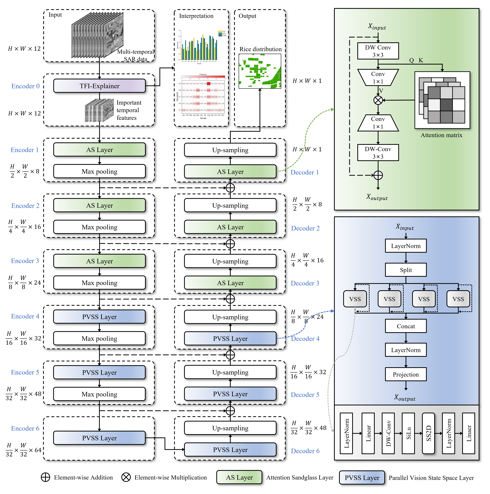

<div align="center">
<h1>eXplainable Mamba UNet - XM-UNet </h1>
<h3>The explainable deep learning model for mapping rice area with SAR images.</h3>

</div>


## Highlights🔥
### *1.The XM-UNet has only 0.019M parameters, 0.279 GFLOPs.*</br>
### *2.The first explainable model for SAR rice area extraction.*</br>

## News🚀
(2024.11.04) ***The project code has been uploaded.***

### Abstract


**0. Main Environments.** </br>
The environment installation procedure can be followed by the steps below (python=3.8):</br>
```
conda create -n xmunet python=3.8
conda activate xmunet
pip install gdal
pip install torch==1.13.0 torchvision==0.14.0 torchaudio==0.13.0 --extra-index-url https://download.pytorch.org/whl/cu117
pip install packaging
pip install timm==0.4.12
pip install pytest chardet yacs termcolor
pip install submitit tensorboardX
pip install triton==2.0.0
pip install causal_conv1d==1.0.0  # causal_conv1d-1.0.0+cu118torch1.13cxx11abiFALSE-cp38-cp38-linux_x86_64.whl
pip install mamba_ssm==1.0.1  # mmamba_ssm-1.0.1+cu118torch1.13cxx11abiFALSE-cp38-cp38-linux_x86_64.whl
pip install scikit-learn matplotlib thop h5py SimpleITK scikit-image medpy yacs
```

**1. Datasets.** </br>
*Prepare your own dataset* </br>
1. The file format reference is as follows. (The image is a muilti-channels tif image. The mask is an 8-bit png image. (0 pixel dots for background, 255 pixel dots for target))
- './your_dataset/'
  - images
    - 0000.tif
    - 0001.tif
  - masks
    - 0000.png
    - 0001.png
  - Prepare_your_dataset.py
1. In the 'Prepare_your_dataset.py' file, change the number of training sets, validation sets and test sets you want.</br>
2. Run 'Prepare_your_dataset.py'. </br>

**2. Train the XM-UNet.**
```
python train.py
```
- After trianing, you could obtain the outputs in './results/' </br>

**3. Test the XM-UNet with full SAR images (*.tif) .**  
First, in the predict.py file, you should change the params below:
resume_model:    the address of the checkpoint
dir_origin_path: specifies the folder path of the images to be used for prediction
dir_save_path:   specifies the path to save the predicted images
```
python predict.py
```
- After testing, you could obtain the outputs in './results/' </br>

**4. Shared data.**  
The rice area distribution map of Kenya for 2022 obtained through temporal transfer prediction using XM-UNet.
```
Kenya_Rice_2022.tif
```
Examples of the data used for testing.
```
example.tif
example.png
```

## Citation
If you find this repository helpful, please consider citing: </br>
```
The citation format will be posted after the manuscript is accepted.
```
